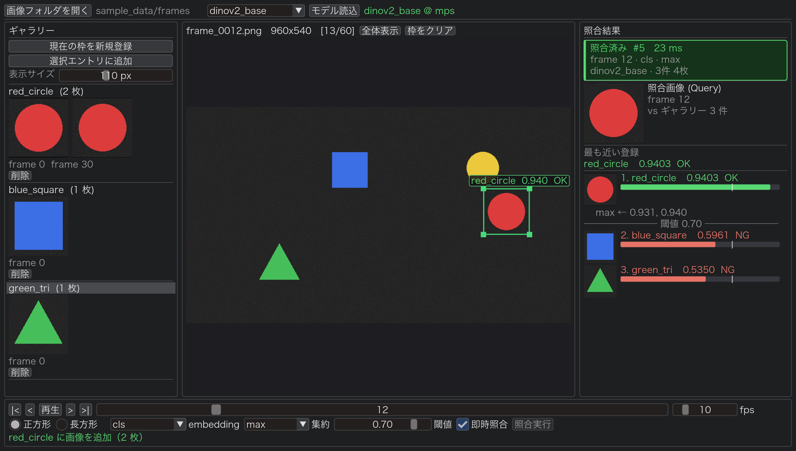

# any_object_viewer

任意物体認証（Arbitrary Object Verification）の検証ツール。

画像群を眺めながら物体を BBox で囲み、特徴抽出モデルの embedding のコサイン類似度で
1:N 照合する GUI。「このモデルはこの 2 つを同一と判断するか？」を対話的に確かめる。



## できること

- 画像フォルダをフレーム列として読み込み（コマ送り / 自動再生 / シーク）
- マウスで BBox を描画・移動・リサイズ（正方形拘束 / 自由アスペクト）
- ギャラリーに登録して 1:N 照合。1 エントリに複数枚（マルチビュー）登録可、集約は max / mean
- 閾値による OK/NG 判定とランキング表示
- embedding 種別の切替（CLS / パッチ平均 / 両者の結合）
- **モデルは差し替え前提**。YAML に登録すれば任意のモデルを読める

## セットアップ

[uv](https://docs.astral.sh/uv/) が必要。

```bash
uv sync
```

## 使い方

```bash
uv run aov
```

1. 「画像フォルダを開く」でフレーム列を選択
2. 「モデル読込」（既定は DINOv2 ViT-B/14。初回のみダウンロード）
3. 画像上を**左ドラッグ**して枠を描く
4. 「現在の枠を新規登録」でギャラリーに追加
5. 別のフレームで枠を描くと、ギャラリー全件とのスコアが出る

| 操作 | 動作 |
|---|---|
| 左ドラッグ | BBox の描画 / 移動 / リサイズ |
| 右・中ドラッグ | パン |
| ホイール | ズーム |

### 動作確認用のサンプルデータ

```bash
uv run python scripts/make_sample_frames.py sample_data/frames
```

4 つの物体が動く 60 フレームを生成する。

### ログ

```bash
AOV_LOG=DEBUG uv run aov   # 照合 1 回ごとのログも出す
```

## モデルの追加

`configs/models.yaml` に追記する。

```yaml
models:
  - name: my_model
    loader: torchscript          # huggingface / torch_hub / torchscript
    args:
      path: /path/to/model.pt
    preprocess:
      input_size: 224
      mean: [0.485, 0.456, 0.406]
      std:  [0.229, 0.224, 0.225]
    embeddings: [output]
```

対応していない形式は、ローダを 1 つ書けば追加できる。
`loaders/` に置いた `.py` は起動時に自動で読み込まれる。

```python
from any_object_viewer.models import register_loader, ModelEntry

@register_loader("my_format")
class MyLoader:
    def load(self, entry: ModelEntry, device: str):
        ...  # FeatureExtractor を返す
```

GUI 側の変更は不要。

## 構成

```
src/any_object_viewer/
├── core/     GUI 非依存のロジック（BBox / フレーム入力 / 前処理 / スコア / ギャラリー）
├── models/   FeatureExtractor インタフェースとローダのレジストリ
└── gui/      imgui-bundle による UI
```

詳細な仕様は [docs/spec.md](docs/spec.md)。
